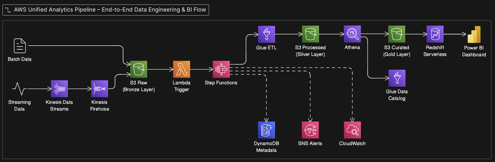

# AWS Unified Analytics Pipeline  
End-to-End Data Engineering & Analytics Project

## 📌 Project Overview

This project demonstrates a complete, production-style data analytics platform combining:

- Batch and real-time data ingestion
- Serverless ETL processing
- Automated orchestration
- Cloud data warehousing
- Business intelligence dashboards

The pipeline processes raw transactional data, transforms it into analytics-ready datasets, loads it into Amazon Redshift, and visualizes insights using Power BI.

---

## 🏗 Architecture



### High-level Flow:

Batch Files → S3 Raw (Bronze Layer)  
Streaming Data → Kinesis → Firehose → S3 Raw  

S3 Raw → AWS Glue ETL → S3 Processed (Silver Layer)  

S3 Processed → Athena CTAS → S3 Curated (Gold Layer)  

S3 Curated → Amazon Redshift  

Amazon Redshift → Power BI Dashboard  

Entire workflow orchestrated using AWS Step Functions and triggered automatically via S3 events and AWS Lambda.

---

## ⚙ Technologies Used

### Cloud & Storage
- Amazon S3 (Data Lake – Bronze, Silver, Gold layers)
- AWS IAM

### Data Processing
- AWS Glue (PySpark ETL)
- AWS Lambda

### Orchestration
- AWS Step Functions

### Analytics & Querying
- Amazon Athena
- AWS Glue Data Catalog

### Data Warehouse
- Amazon Redshift Serverless

### Streaming
- Amazon Kinesis Data Streams
- Amazon Kinesis Firehose

### Monitoring & Metadata
- Amazon CloudWatch
- Amazon DynamoDB
- Amazon SNS

### Visualization
- Microsoft Power BI

---

## 📂 Project Structure
```
aws-unified-analytics-pipeline/
├── architecture/
├── ingestion/
├── etl/
├── orchestration/
├── analytics/
├── warehouse/
├── dashboard/
└── README.md
```
---

## 🔄 Pipeline Features

✔ Automated batch + streaming ingestion  
✔ Serverless ETL with PySpark  
✔ Partitioned Parquet data lake  
✔ Cleaned and curated analytics tables  
✔ Full workflow orchestration  
✔ Error handling + alerts  
✔ Redshift loading via COPY  
✔ Business dashboards  

---

## 📊 Power BI Dashboard

Sample insights include:

- Total revenue trends
- Revenue growth percentage
- Top products by revenue
- City-wise performance
- Order volumes

(Screenshots available in `dashboard/powerbi_screenshots/`)

---

## 🚀 How It Works (Simplified)

1. Data arrives in S3 Raw Layer  
2. S3 event triggers Lambda  
3. Lambda starts Step Functions workflow  
4. Glue cleans & transforms data  
5. Athena builds curated tables  
6. Redshift loads analytics tables  
7. Power BI visualizes results  

---

## 💡 Key Learnings

- End-to-end cloud data engineering pipeline design
- Handling batch + streaming data together
- Serverless ETL optimization
- Orchestration best practices
- Data lake layering strategy
- Analytics-ready warehouse modeling
- BI integration

---

## 👤 Author

Vinit Vajani  

Data Engineer | AWS | Python | SQL | ETL Pipelines  

LinkedIn: https://www.linkedin.com/in/vinit-vajani-8672b8208/

GitHub: https://github.com/vinitvajani
